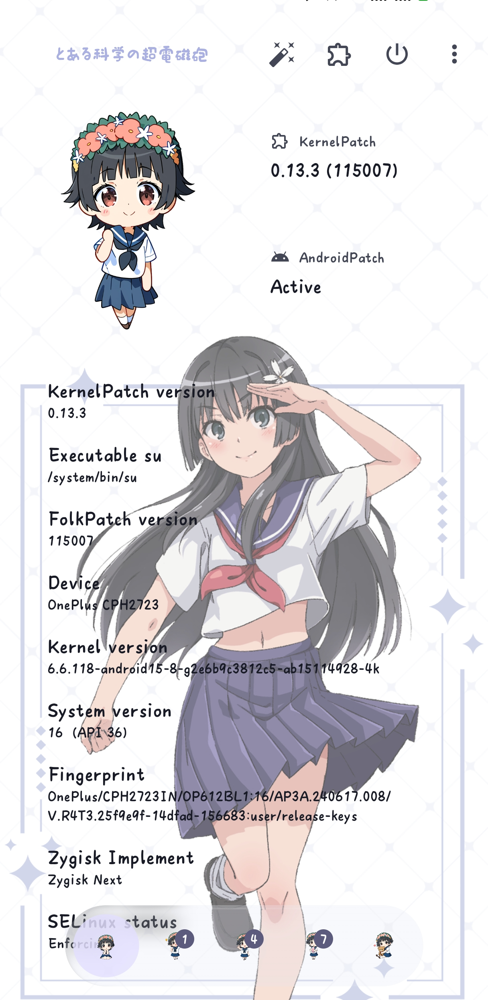
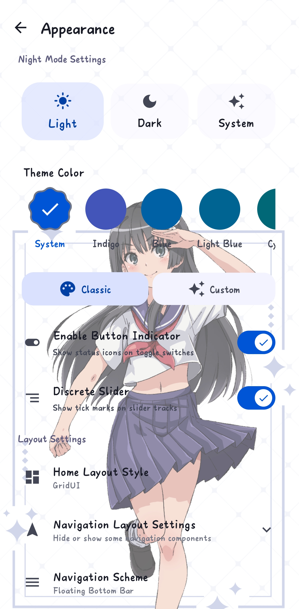
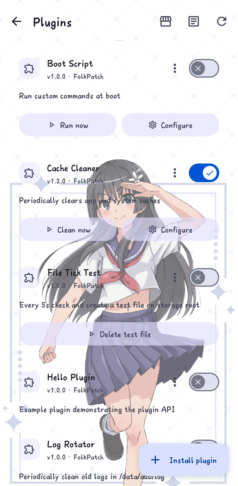
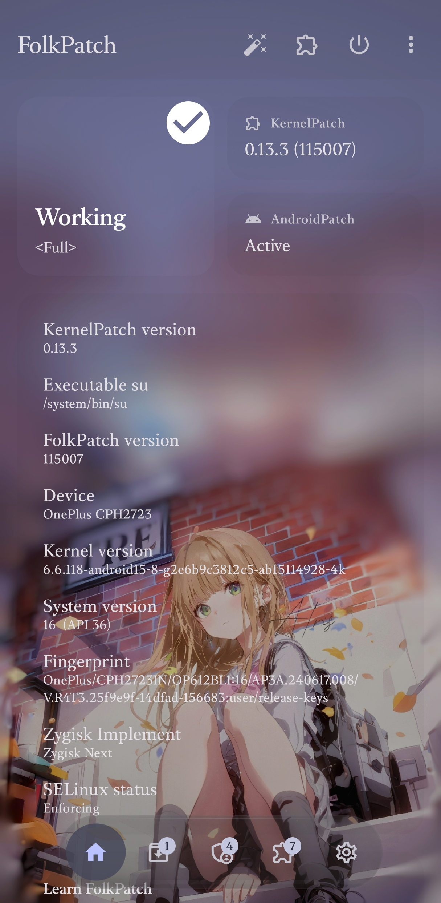
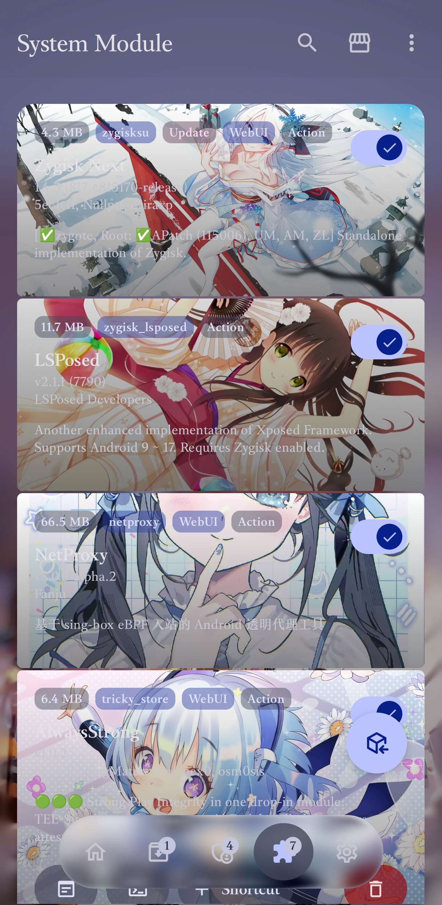
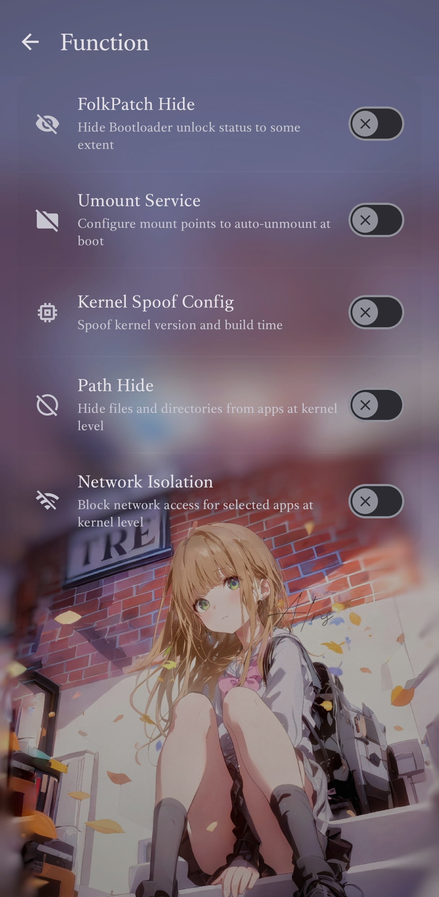

🌏 **README Language:** [**English**](./README_EN.md) / [**中文**](./README.md) / [**日本語**](./README_JA.md)

FolkPatch - A Root management tool focused on interface optimization and feature extension

Built on KernelPatch, FolkPatch delivers a stable Root experience along with a brand-new interface and a three-tier extension system: APM / KPM / Plugins. Get started quickly with our comprehensive documentation — installation, module management, plugin development, and personalization, all in one place.

[📚 Read Full Documentation](https://fp.mysqil.com/) →

<table>
  <tr>
    <td></td>
    <td></td>
    <td></td>
  <tr>
  <tr>
    <td></td>
    <td></td>
    <td></td>
  <tr>
</table>

---

## ✨ Introduction

### 🎨 Core Features
- [x] Root implementation based on KernelPatch
- [x] Hook kernel functions without recompiling the kernel

### 📱 Prerequisites

- **Required:** ARM64 architecture Android device with Linux kernel version 3.18 to 6.15

### 🎨 Manager Interface & Design
- [x] Brand new UI and interaction experience optimization
- [x] Personalized wallpaper support
- [x] Internationalization support
- [x] Animation performance and interaction fluency optimization
- [x] Interface visual details and dynamic effects enhancement
- [x] Support for manually disabling automatic update checks, giving users control over version upgrades

### 📦 Modules & Extension System

FolkPatch provides a three-tier extension system covering customization needs from kernel to user space:

- [x] **APM**: Magisk-like module system, supports batch flashing and full backup
- [x] **KPM**: Kernel module system (supports inline-hook and syscall-table-hook), supports automatic loading
- [x] **Plugins (APD Lua Plugin)**: Lightweight Lua script extensions, sitting between APM and KPM
- [x] Download popular APMs, KPMs and plugins through the built-in store

### 🧩 Plugin System (APD Lua Plugin)

Plugins are FolkPatch's lightweight user-space extensions, positioned between APM (system-level modules) and KPM (kernel-level modules): no system file modification, no kernel injection — just Lua scripts running in the `apd` lifecycle. Unlike traditional modules, plugins take effect immediately after installation without a reboot, and are much easier to develop.

Supported capabilities:

- Enable/disable switch
- Quick actions and user configuration UI
- Scheduled daemon tasks (background polling)
- Persistent execution logs with viewing, exporting and sharing

For the full plugin documentation (package format, API, lifecycle, management commands), see:

- 🇬🇧 English: https://fp.mysqil.com/en/modules/plugin/
- 🇨🇳 中文: https://fp.mysqil.com/modules/plugin/

### ⚡ Technical Features
- [x] Based on [KernelPatch](https://github.com/LyraVoid/KernelPatch/)

## 🚀 Download & Install

1. **Download:**
   Get the latest installation package from the [Releases page](https://github.com/LyraVoid/FolkPatch/releases/latest)

2. **Install:**
   Install the package on your Android device and follow the in-app guide

3. **Get Started:**
   Read the [full documentation](https://fp.mysqil.com/) for module management, plugin development and more

## 🙏 Open Source Credits

This project is based on the following open source projects:

- [KernelPatch](https://github.com/LyraVoid/KernelPatch/) - Core component
- [Magisk](https://github.com/topjohnwu/Magisk) - magiskpolicy
- [KernelSU](https://github.com/tiann/KernelSU) - App UI and Magisk-like module support
- [Sukisu-Ultra](https://github.com/SukiSU-Ultra/SukiSU-Ultra) - Referenced some interface designs
- [APatch](https://github.com/bmax121/APatch) - Upstream branch
- [MMRL](https://github.com/MMRLApp/MMRL) - Module repository data format reference and data source
- [Shizuku](https://github.com/RikkaApps/Shizuku) - Built-in Shizuku service

## 📄 License

- FolkPatch is open sourced under the [GNU General Public License v3 (GPL-3)](http://www.gnu.org/copyleft/gpl.html) license. As a modifier or distributor, you must comply with the following standards:
- If you modify the code or integrate FolkPatch into your project and distribute it to a third party, your entire project must also be open sourced under the GPLv3 license
- When distributing binary files, you must actively provide or promise to provide complete and readable source code
- Strictly prohibit charging licensing fees for the software license itself. You may charge for distribution, technical support, or customized development
- Distribution implies that you grant all users the relevant patents involved in the use of the project
- This software is provided "as is", without any warranty. The original author is not responsible for any losses caused by using this software
- Any violation of the above terms will automatically terminate your GPLv3 license. At that time, you will lose the legal right to distribute FolkPatch. The original author reserves the right to pursue copyright infringement liability (including but not limited to applying for injunctions to stop infringement, economic compensation, and removing infringing projects)

## 💬 Community & Discussion

### FolkPatch Discussion & Communication
- Telegram Channel: [@FolkPatch](https://t.me/FolkPatch)
